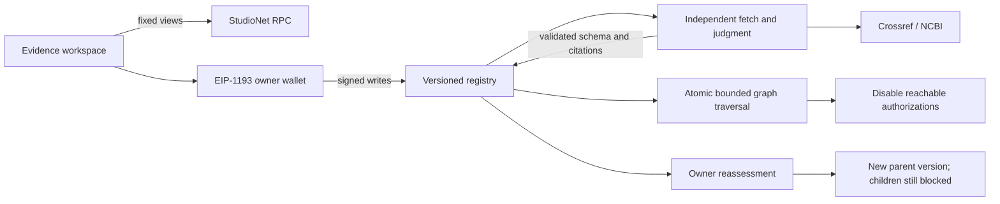

# Recall

**Evidence changes. Decisions follow.** Recall asks: “This evidence was corrected or withdrawn. Which decisions now need reviewing?”

[Open Recall](https://recall-genlayer.vercel.app) · [Proof](docs/PROOF_MANIFEST.md) · [Demo](docs/DEMO.md) · [Tutorial](docs/TUTORIAL.md) · [Submission handoff](docs/OWNER_SUBMISSION.md)

Application repository: [JWattjr/Recall](https://github.com/JWattjr/Recall). Recall builds on the [Evidence Retraction Registry contract accepted September 28, 2026](https://portal.genlayer.foundation/contribution/212407). This repository preserves that history and adds the complete application: recorded cases, live finalized reads, wallet workflows, proof inspection, owner recovery and the verified material-correction case. The earlier accepted contract is disclosed, not claimed as new work.

GenLayer independently reads a registered publication and a notice. A material correction or retraction versions changed evidence and atomically disables every reachable future authorization in a bounded dependency graph. Unrelated branches remain active. Owners explicitly reassess blocked decisions against current evidence; recovering a parent never recovers its children.

The grants and authorizations are synthetic fixtures; Crossref and NCBI publications are authentic public records. Active describes registry state, not scientific truth or publisher certification. Recall cannot reverse completed payments or establish institutional authority.

## Try the workspace

No wallet is needed to explore either recorded retraction or material correction, inspect citations and digests, or trace direct/transitive dependents. Mobile uses an accessible list. **Live network** reads timestamped finalized state for the explicit case manifest, for both cases: `decision-a` recovered to ACTIVE v2 while `decision-b`, `correction-parent` and `correction-child` remain blocked. Failed live reads retain an explicitly labeled snapshot. There is no global source/decision listing view; add known IDs to this browser's bounded manifest.

**Local rehearsal** is scripted and generates no hashes or consensus. **Proof & history** separates historical receipts, dated owner-recovery proof, live state and off-chain availability checks.

To write, connect an EIP-1193 wallet on StudioNet 61999. Register a publication source and decisions with a frozen purpose and valid dependencies. The registering wallet becomes decision owner; only that wallet can reassess. The preflighted notice example pairs DOI `10.11607/prd.476` with its published retraction. Register a new copy of that study before submitting: historical sources are already withdrawn. No public server signing endpoint exists.

## Verified deployment

| Item | Value |
|---|---|
| Network | GenLayer StudioNet, chain 61999; hosted development simulator |
| RPC | `https://studio.genlayer.com/api` |
| Contract | `0x91C663Df0D7103614485283D3A1E49Cf525f5fda` |
| Contract source | [Source](contracts/evidence_retraction_registry.py), matched by SHA-256 |
| Runner | `py-genlayer:1jb45aa8ynh2a9c9xn3b7qqh8sm5q93hwfp7jqmwsfhh8jpz09h6` |
| Source SHA-256, normalized LF / trimmed end | `218f011d2e26bc6d35033f9781b406e39ab8598af0f91fa118c85b5a930c5804` |

On 4 October 2026 the new instance finalized 12 successful writes, including deployment. A real retraction and an explicit percentage correction each produced source v2 and blocked direct/transitive dependents while preserving an independent branch. Owner reassessment restored decision-a to ACTIVE v2 / SUPPORTED; decision-b stayed blocked. Every transition matched finalized state reads. See [proof manifest](docs/PROOF_MANIFEST.md) and [verification](docs/RELEASE_VERIFICATION.md).

## Reproduce

Frontend needs Node.js 20.9+ (release used 24.12.0):

```powershell
cd frontend
npm ci
npm run dev
# http://localhost:3000
npm run typecheck
npm test
npm run build
npm start
```

Read-only exploration needs no environment variables. Next.js 16.3.8, React 19.2.4, genlayer-js 1.1.8 and viem 2.57.2 are pinned. Fonts are self hosted. Vercel deploys `frontend`; configure that root in your own Git integration or run `vercel --prod` there. Forks should create their own project.

Contract setup from this repository root:

```powershell
python -m venv .venv
.\.venv\Scripts\python.exe -m pip install -r requirements.txt
.\.venv\Scripts\python.exe -m pytest -q
.\.venv\Scripts\genvm-lint.exe check contracts/evidence_retraction_registry.py --json
.\.venv\Scripts\genvm-lint.exe schema contracts/evidence_retraction_registry.py --output contracts/abi.json
```

The shipping run used the existing parent-directory environment; exact commands and results are in [release verification](docs/RELEASE_VERIFICATION.md). Direct tests mock web/model I/O. `npm run verify:network` performs read-only checks and rechecks all 12 new receipts and both final cases, writing deployments/recall-v2-network-verification.json. Local operator scripts require the owner's unlocked OS-keychain account, remain outside the application bundle, and save submitted IDs to resume without resubmitting.

## Mechanism



Bounds: 12 sources, 24 decisions, 16 notices, four source and four decision parents, eight versions per record, three notice references and 5,000-byte strict UTF-8 bodies. Edges refer to earlier active decisions. Read [architecture](docs/ARCHITECTURE.md), [security](docs/SECURITY_NOTES.md), and [tests](docs/TEST_MATRIX.md).

Publisher identity, signatures, resolved DNS destinations, redirects, freshness and institutional authority are not authenticated. Off-chain preflight does not prove validator availability. Explorer routing is unverified, so IDs are copyable. Production-chain operation is untested. V1 proofs remain under `deployments/v1/`; v1 submission documents remain under `docs/archive-v1/`, alongside `docs/HISTORICAL_*`.

Recall differs from Bullseye and charter work-acceptance apps through persistent evidence dependencies, transitive invalidation and explicit recovery. No ecosystem-wide originality or Portal award claim is made. The owner must review current authenticated Portal task rules and submit manually.
